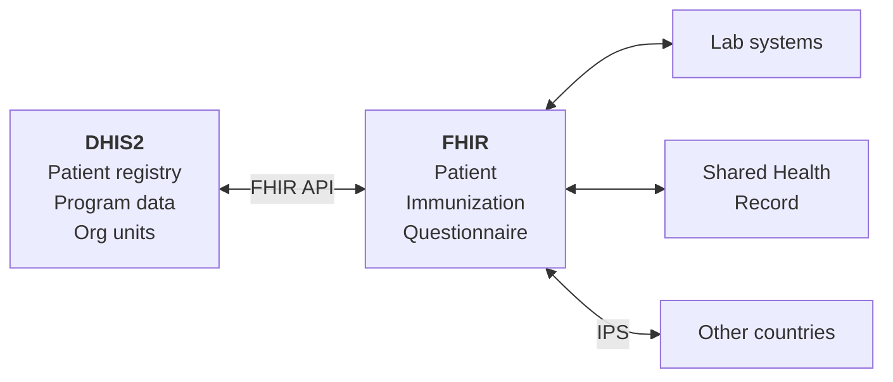
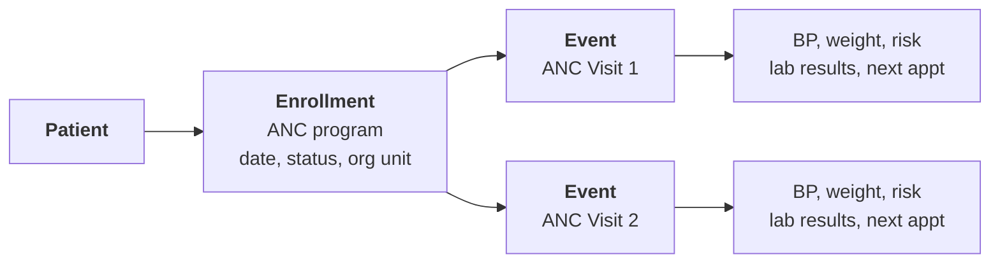
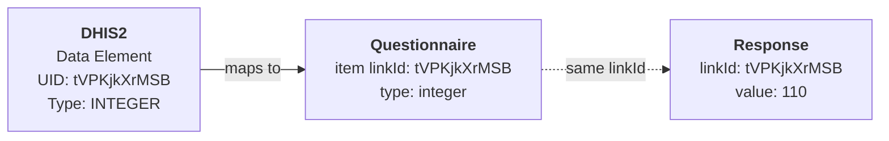
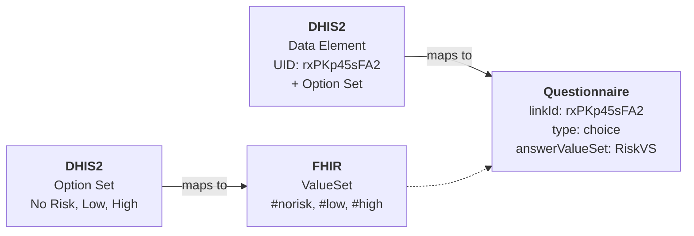
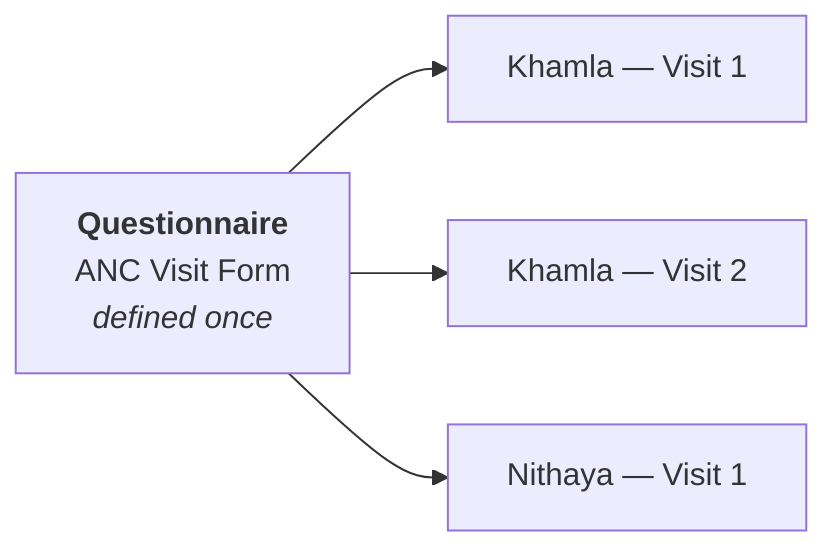

# Part 2: DHIS2 Meets FHIR

---

# The Big Picture

FHIR is the **common language** between systems. DHIS2 is one of many.



Data flows **both ways**: DHIS2 can publish data as FHIR, and consume FHIR from other systems.

---

# DHIS2 → FHIR Mapping

| DHIS2 concept | FHIR resource | Notes |
|---------------|---------------|-------|
| Tracked Entity | Patient | Demographics + identifiers |
| Program Stage | Questionnaire | Form definition |
| Event | QuestionnaireResponse | Submitted form data |
| Data Element | Questionnaire item | Each field in the form |
| Option Set | ValueSet + CodeSystem | Coded answer options |
| Organisation Unit | Organization / Location | Facility hierarchy |

---

# Why Questionnaire?

FHIR has specific clinical resources (Encounter, Observation, Condition). Why not use those?

<v-clicks>

- **Simpler** — flat form structure, not deep clinical modeling
- **1:1 mapping** — Program Stage = Questionnaire, Event = Response
- **Familiar** — looks like a form/spreadsheet, not a clinical document
- **Linked to Patient** — each Response has a `subject` reference
- **Flexible** — any DHIS2 program can be represented without custom mapping
- **Trade-off** — less semantic richness, but much more practical for DHIS2 integration

</v-clicks>

---

# What about Enrollments?

In DHIS2, a patient is **enrolled** in a program before events are recorded.



<div class="text-sm">

The enrollment is also a **QuestionnaireResponse** — a form that captures enrollment date, program, and org unit. Events are separate QRs linked to the same Patient.

</div>

<div class="absolute bottom-8 left-12 right-12 text-sm opacity-50">

FHIR has EpisodeOfCare for enrollments, but QR keeps things consistent.

</div>

---

# Questionnaire — DHIS2 Terms

| DHIS2 | FHIR Questionnaire | Example |
|-------|-------------------|---------|
| Program Stage | Questionnaire | "ANC Visit" |
| Section | group item | "Vital Signs" |
| Data Element | item (with linkId) | "Systolic BP" |
| Data Element UID | linkId | `tVPKjkXrMSB` |
| Data Element type | item type | `integer` |
| Option Set | answerValueSet | Risk Factor options |

<div class="absolute bottom-8 left-12 right-12 text-sm opacity-50">

A Questionnaire is the blank form template. It defines the questions but contains no answers.

</div>

---

# What is a linkId?

Each DHIS2 Data Element has a **UID**. In FHIR, that UID becomes the **linkId**:



<v-clicks>

- The **linkId** = the DHIS2 data element UID
- It appears in both the question and the answer
- That's how you know which answer belongs to which question

</v-clicks>

---

# What about Option Sets?

When a Data Element has an **Option Set**, it becomes a `choice` item with a **ValueSet**:



**Option Set** → **ValueSet** (with codes in a CodeSystem). The item references it via `answerValueSet`.

---

# Questionnaire Structure

A form is a tree: **groups** (sections) contain **items** (questions):

```
ANC Visit Form
├── Visit Information (group)
│   ├── ANC visit #        — choice (→ ValueSet)  — linkId: kyclqodZVDs
│   └── Risk Factor        — choice (→ ValueSet)  — linkId: rxPKp45sFA2
├── Vital Signs (group)
│   ├── Systolic BP        — integer (mmHg)       — linkId: tVPKjkXrMSB
│   └── Fetus heart rate   — decimal (bpm)        — linkId: NjD9TNfcUu5
└── Lab Tests (group)
    ├── Hb test done?      — boolean              — linkId: uRM5be7E75w
    └── Hb result          — choice (→ ValueSet)  — linkId: FlkD0kQhHhJ
```

Each item has a **linkId** (data element UID), **text** (label), and **type**.

---

# Item Types

| Type | Input | DHIS2 equivalent |
|------|-------|------------------|
| `string` | Free text | TEXT |
| `integer` | Whole number | INTEGER |
| `decimal` | Decimal number | NUMBER |
| `boolean` | Yes/No checkbox | BOOLEAN |
| `date` | Date picker | DATE |
| `choice` | Dropdown/radio | Option Set |
| `group` | Section container | Section |

---

# QuestionnaireResponse

A **submitted form with answers** — like a DHIS2 Event.

<div class="grid grid-cols-2 gap-6 mt-4">
<div>

### Contains
- **questionnaire** — which form was filled
- **subject** — which Patient
- **authored** — when submitted
- **status** — `completed`, `in-progress`
- **item[]** — the answers

</div>
<div>

### Each answer has
- **linkId** — matches the question
- **answer** — typed value:
  - `valueInteger: 110`
  - `valueDecimal: 54.5`
  - `valueBoolean: true`
  - `valueDate: "2024-07-13"`
  - `valueCoding: { code, display }`

</div>
</div>

---

# QuestionnaireResponse — Example

Khamla's ANC visit on June 15, 2024:

```json
{
  "resourceType": "QuestionnaireResponse",
  "questionnaire": "http://moh.gov.la/fhir/Questionnaire/LaoANCVisit",
  "status": "completed",
  "subject": { "reference": "Patient/seed-patient-006" },
  "authored": "2024-06-15",
  "item": [
    { "linkId": "kyclqodZVDs", "text": "Number of ANC visit",
      "answer": [{ "valueCoding": { "code": "1", "display": "1st visit" } }] },
    { "linkId": "tVPKjkXrMSB", "text": "Systolic BP",
      "answer": [{ "valueInteger": 110 }] },
    { "linkId": "uRM5be7E75w", "text": "Hemoglobin test done?",
      "answer": [{ "valueBoolean": true }] }
  ]
}
```

---

# How are they linked?

The Questionnaire **defines** the questions. The Response **captures** the data.

| | Questionnaire (template) | | QuestionnaireResponse (data) |
|---|---|---|---|
| linkId: **tVPKjkXrMSB** | Systolic BP, type: integer | → | answer: **110** |
| linkId: **rxPKp45sFA2** | Risk Factor, type: choice | → | answer: **#norisk** |
| linkId: **uRM5be7E75w** | Hb test done?, type: boolean | → | answer: **true** |

The **linkId** is the same in both — that's how each answer is matched to its question.

---

# One template, many submissions



- **Questionnaire** = Program Stage (defined once)
- **QuestionnaireResponse** = Event (one per patient per visit)
- `subject` links to the Patient, `questionnaire` links to the template
