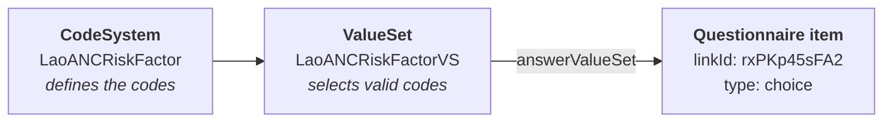

# Part 3: Defining FHIR Metadata

---

# FHIR Profiles

Profiles **constrain** base resources for local requirements:

```
Base Patient → DHIS2 Patient Profile → Lao CHR Patient Profile
```

<v-clicks>

- **Require** specific fields (e.g., CHR ID is mandatory)
- **Restrict** value sets (e.g., only Lao ethnicity codes)
- **Add extensions** for fields FHIR doesn't have
- **Slice identifiers** (DHIS2 UID, National ID, CHR ID, CVID)

</v-clicks>

---

# Why Extensions?

FHIR's base Patient has name, gender, birthDate, address — but **not everything**:

| CHR field | In base FHIR? | Solution |
|-----------|--------------|----------|
| Name, gender, DOB | Yes | Standard fields |
| Province, district | Yes | `address.state`, `.district` |
| Ethnicity | No | **Extension** |
| Occupation | No | **Extension** |
| Blood group | No | **Extension** |
| Education level | No | **Extension** |

Every country/program will need some extensions — this is normal and expected.

---

# FHIR Terminology

Standardized vocabularies for coded data:

| System | Use | Example |
|--------|-----|---------|
| **CVX** | Vaccine codes | `19` = BCG, `94` = MR |
| **SNOMED CT** | Clinical terms | `56717001` = Tuberculosis |
| **LOINC** | Lab/observation codes | `29463-7` = Body weight |
| **Local CodeSystems** | Country-specific | Lao ethnicity, occupation |

A **CodeSystem** defines the codes. A **ValueSet** picks which are valid for a specific field.

---

# Terminology in Practice

The ANC "Risk Factor" classifies pregnancy risk — it determines the care pathway:



| Code | Display | Meaning |
|------|---------|---------|
| `#norisk` | No Risk — Green | Normal pregnancy, routine ANC |
| `#low` | Low Risk — Yellow | Minor risk, closer monitoring |
| `#high` | High Risk — Red | Referral needed, specialist care |
