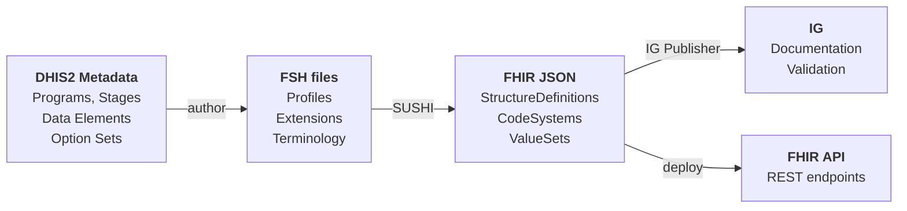

# Part 4: Building the Integration

---

# Implementers & Developers

<div class="grid grid-cols-2 gap-8 mt-4">
<div class="border-l-4 border-amber-400 pl-4">

### Implementers design

- Profiles — required fields, extensions
- Terminology — code systems for local concepts
- Identifier strategy — CHR ID, national IDs
- Workflow — search-or-create, EIR lookup
- Data quality — validation rules

</div>
<div class="border-l-4 border-blue-400 pl-4">

### Developers build

- FSH profiles from implementer designs
- Terminology from DHIS2 Option Sets
- Questionnaire definitions from Program Stages
- Validation with SUSHI + IG Publisher
- Integration layer (DHIS2 ↔ FHIR)

</div>
</div>

---

# FSH — FHIR Shorthand

Human-readable syntax for authoring profiles:

```yaml
Profile: LaoPatient
Parent: Patient
Title: "Lao PDR Patient"

* name 1..* MS          // at least one name, must support
* gender 1..1 MS        // exactly one gender, required
* birthDate 1..1 MS     // exactly one birth date, required
* address 0..* MS       // optional but must support
```

- `1..1` = required, `0..*` = optional, `1..*` = at least one
- `MS` = Must Support (client must handle this field)

---

# FSH — Extensions & Terminology

```yaml
Extension: ChrEthnicity
Title: "Ethnicity"
* value[x] only CodeableConcept
* valueCodeableConcept from ChrEthnicityVS (required)

CodeSystem: ChrEthnicityCS
* #lao "Lao"
* #khmou "Khmou"
* #hmong "Hmong"
* #phouthai "Phouthai"

ValueSet: ChrEthnicityVS
Title: "Lao Ethnicity"
* include codes from system ChrEthnicityCS
```

---

# FSH — Instances (Examples)

```yaml
Instance: ExampleLaoPatient
InstanceOf: LaoPatient
Title: "Example — Khamla Phommasan"
Usage: #example

* name[0].family = "Phommasan"
* name[0].given[0] = "Khamla"
* gender = #female
* birthDate = "2019-03-15"
* address[0].city = "Anou"
* address[0].state = "Vientiane Capital"
* address[0].country = "LA"
* extension[ethnicity].valueCodeableConcept
    = ChrEthnicityCS#lao "Lao"
```

Examples are included in the IG and used for validation testing.

---

# The DHIS2 ↔ FHIR Pipeline

From DHIS2 metadata to a running FHIR API:



<v-clicks>

- **Implementers** design the metadata mapping (DHIS2 → FSH)
- **SUSHI** compiles FSH to FHIR JSON (automated)
- **IG Publisher** builds documentation & validation rules
- **Developers** deploy the API that serves the data

</v-clicks>

---

# Tooling Overview

| Tool | Purpose |
|------|---------|
| **SUSHI** | Compile FSH → FHIR JSON |
| **IG Publisher** | Build full Implementation Guide (HTML) |
| **HAPI FHIR** | Java-based FHIR server |
| **Postman** | Test FHIR REST APIs |
| **FastAPI** | Python web framework (this project) |
