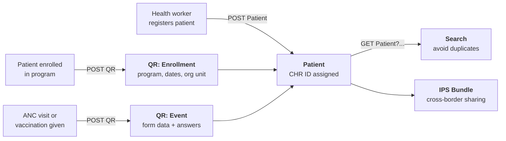
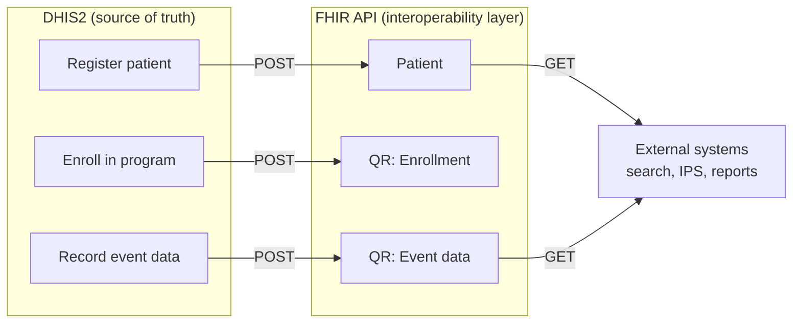

# Part 5: FHIR for EIR in Lao PDR

---

# Lao CHR Overview

**Community Health Record** — national health information system built on DHIS2.

<v-clicks>

- **Patient registry** with 6+ identifier types
- **EIR** — Electronic Immunization Registry (national EPI schedule)
- **FHIR mapping** — CHR data exposed as FHIR resources
- **Search** — by identifier, name, demographics, phone, village

</v-clicks>

---

# Data Flow — Input & Output



---

# CHR Patient — Identifiers

Each patient can have multiple identifiers across systems:

| Type | FHIR System | Example |
|------|-------------|---------|
| CHR ID | `client-health-id` | `15032019-2-6092` |
| National ID | `green-national-id` | `LA-1998-41270` |
| CVID | `cvid` | `CVID-60104292` |
| Passport | `passport` | `LA-P482917` |
| Insurance | `insurance` | `INS-LA-30421` |
| Family Book | `family-book` | `FB-60293` |

In DHIS2: each is a Tracked Entity Attribute. In FHIR: each is a slice on `Patient.identifier`.

---

# CHR Patient — Extensions & Address

<div class="grid grid-cols-2 gap-8 mt-4">
<div>

### Custom extensions
- Nationality
- Ethnicity (49 ethnic groups)
- Occupation
- Education level
- Blood group

</div>
<div>

### Address mapping
| CHR field | FHIR field |
|-----------|------------|
| Province | `address.state` |
| District | `address.district` |
| Village | `address.city` |

</div>
</div>

---

# EIR — Lao EPI Schedule

Vaccines mapped to FHIR Immunization using **CVX codes**:

| Vaccine | CVX | Age |
|---------|-----|-----|
| BCG | 19 | Birth |
| Hepatitis B (birth) | 45 | Birth |
| OPV (3 doses) | 2 | 2, 4, 6 mo |
| Pentavalent (3 doses) | 102 | 2, 4, 6 mo |
| PCV13 (3 doses) | 152 | 2, 4, 6 mo |
| Measles-Rubella (2 doses) | 94 | 9, 18 mo |

---

# EIR — Immunization Resource

```json
{
  "resourceType": "Immunization",
  "status": "completed",
  "patient": { "reference": "Patient/seed-patient-006" },
  "vaccineCode": {
    "coding": [{ "system": "http://hl7.org/fhir/sid/cvx",
                 "code": "19", "display": "BCG" }]
  },
  "occurrenceDateTime": "2019-03-15",
  "protocolApplied": [{
    "doseNumberPositiveInt": 1,
    "targetDisease": [{
      "coding": [{ "system": "http://snomed.info/sct",
                   "code": "56717001", "display": "Tuberculosis" }]
    }]
  }]
}
```

---

# What does the integration actually do?



DHIS2 **pushes** data out as FHIR. External systems **pull** data via the FHIR API.

---

# International Patient Summary

IPS = cross-border immunization verification.

<v-clicks>

- A **document Bundle** containing:
  - **Composition** — table of contents
  - **Patient** — demographics
  - **Immunizations** — vaccination history
- Critical for Lao PDR with 4 neighboring countries
- Standardized format — any IPS-compliant system can read it

</v-clicks>

---

# IPS — Bundle Structure

```json
{
  "resourceType": "Bundle",
  "type": "document",
  "entry": [
    { "resource": { "resourceType": "Composition",
                     "title": "International Patient Summary" } },
    { "resource": { "resourceType": "Patient",
                     "name": [{"family": "Vongsa", "given": ["Somchai"]}] } },
    { "resource": { "resourceType": "Immunization",
                     "vaccineCode": {"coding": [{"code": "19", "display": "BCG"}]} } },
    { "resource": { "resourceType": "Immunization",
                     "vaccineCode": {"coding": [{"code": "94", "display": "MR"}]} } }
  ]
}
```

---

# Live Demo

<div class="text-center mt-8">

### http://localhost:8000

</div>

<div class="grid grid-cols-2 gap-4 mt-6 text-sm">

<div class="border rounded p-3">

**Patient Search** — browse, filter, identifier lookup

</div>

<div class="border rounded p-3">

**CHR Dashboard** — stats, search, registration

</div>

<div class="border rounded p-3">

**EIR** — immunization history per patient

</div>

<div class="border rounded p-3">

**IPS Bundles** — document view with composition

</div>

<div class="border rounded p-3">

**Forms** — fill & submit questionnaires

</div>

<div class="border rounded p-3">

**FHIR API** — JSON responses, Postman collection

</div>

</div>
